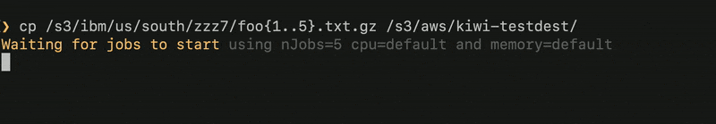
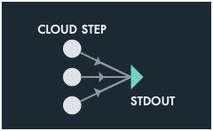
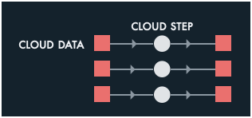
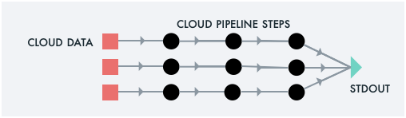
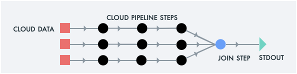
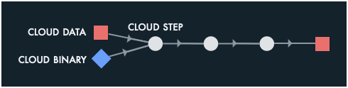
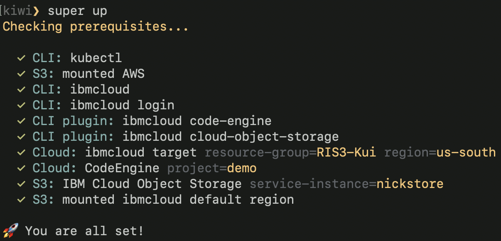

#### [Examples](#examples)  | [Tutorials](#tutorials) | [Blogs](#blogs) | [Installation](#installation)

# Super: A CLI for the Serverless Supercomputer

**Super** runs a normal UNIX command line against Cloud data, using
Cloud compute resources. Super takes care of provisioning the right
amount of compute, memory, and disk capacity, scheduling your jobs,
granting the needed data access authority to your work, and streaming
out logs &mdash; all in one command: `super run`.


Super also automatically injects logic to track the progress of
**any** job against your Cloud data. You get helpful progress bars for
free.



Super links Cloud compute from [IBM Cloud Code
Engine](https://www.ibm.com/cloud/code-engine) with Cloud data in any
S3 provider, such as [IBM Cloud Object
Storage](https://www.ibm.com/cloud/object-storage).

<a name="examples"></a>
## Five Super Powers

Using Super, you may pipe data through Cloud-based pipelines in a
variety of ways. You may auto-scale across input Cloud data. You may
join the results of each parallel Cloud job and display the results on
your local console. You may pipe this joined output into local
pipelines. You may redirect the output of each Cloud job back into
Cloud storage. 

**Click on one of these images for more details on that use case.**

[](docs/examples/example1.md)
[](docs/examples/example2.md)
[](docs/examples/example3.md)
[](docs/examples/example4.md)
[](docs/examples/example5.md)

## Tutorials

- [Getting to Know Super](docs/tutorial/basics/#readme)

## Blogs

- [Exploring Big Data with a CLI](https://medium.com/the-graphical-terminal/exploring-big-data-with-a-cli-59af31d38756)
- [Bash the Cloud](docs/blogs/1-Super-Overview/README.md#readme)

## Installation



The latest build of Super is available
[here](https://github.com/IBM/super/releases). After you have downloaded
your release:

```sh
tar jxf Super-darwin-x64.tar.bz2
export PATH=$PWD/Super-darwin-x64/Super.app/Contents/Resources:$PATH
super
```

You should now see usage information for Super, including the main
sub-commands:
- [`super up`](docs/commands/super-up.md)
- [`super run`](docs/commands/super-run.md)
- [`super dashboard`](docs/tutorial/basics/super-dashboard.md)
- [`super browse`](docs/tutorial/basics/super-browse.md)

We suggest first trying [`super up`](docs/commands/super-up.md), which
will validate your prerequisites. If you are good to go, then you can
try `super run -p5 -- echo hello`, which will execute that command as
five Cloud jobs. If this all looks good, then proceed to the
[**Getting to Know Super**](docs/tutorial/basics#readme) tutorial.
