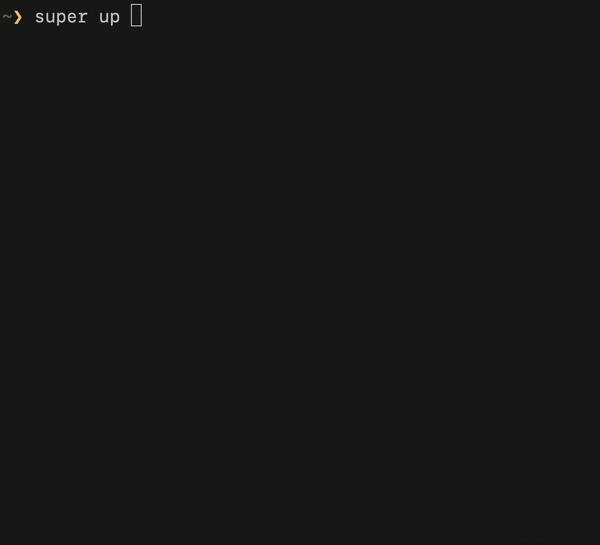

#### [Installation](#installation) | [Tutorials](#tutorials) | [Blogs](#blogs)

# Super: A CLI for the Serverless Supercomputer

**Super** runs a normal UNIX command line against Cloud data, using
Cloud compute resources. Super takes care of provisioning the right
amount of compute, memory, and disk capacity, scheduling your jobs,
granting the needed data access authority to your work, and streaming
out logs &mdash; all in one command: `super run`.


Super also injects logic to **track the progress of any job** against
your Cloud data. You get helpful progress bars for free.


Super links Cloud compute to **any Kubernetes cluster**, and links to
Cloud data to **any S3 provider**. Out of the box, it has integrations
with [IBM Cloud Code Engine](https://www.ibm.com/cloud/code-engine),
which offers a fast way to tap into a very large Kubernetes
cluster. It also can transparently hook up with [IBM Cloud Object
Storage](https://www.ibm.com/cloud/object-storage).

<a name="examples"></a>
## Six Super Powers

Super can process data via Cloud-based pipelines in a variety of ways:
e.g. you may **auto-scale** across a set of input Cloud data, **join**
the results of each parallel Cloud job and display the results on your
local console, **redirect** output back into Cloud storage, or execute
pipelines **periodically**. All with familiar shell syntax and
performance.

**Click on one of these images for more details on that use case.**


[](docs/examples/example1.md)
[](docs/examples/example2.md)
[](docs/examples/example3.md)
[](docs/examples/example4.md)
[](docs/examples/example5.md)
[](docs/examples/example6.md)

## Installation

[macOS Intel](https://github.com/IBM/super/releases/latest/download/Super-darwin-x64.tar.bz2) **|** [macOS Apple Silicon](https://github.com/IBM/super/releases/latest/download/Super-darwin-arm64.tar.bz2)

You may also use `curl` to download a build for your platform
directly. For example, on macOS Intel:

```sh
curl -L https://supe.run/releases/latest/download/Super-darwin-x64.tar.bz2 | tar jxf -
export PATH=$PWD/Super-darwin-x64/Super.app/Contents/Resources:$PATH
super
```

> For those of you using Apple Silicon, replace `x64` with `arm64`



You should now see usage information for Super, including the main
sub-commands:
- [`super up`](docs/commands/super-up.md)
- [`super run`](docs/commands/super-run.md)
- [`super browse`](docs/tutorial/basics/super-browse.md)

We suggest first trying [`super up`](docs/commands/super-up.md), which
will validate your prerequisites. If you are good to go, then you can
try `super run -p5 -- echo hello`, which will execute that command as
five Cloud jobs. If this all looks good, then proceed to the
[**Getting to Know Super**](docs/tutorial/basics#readme) tutorial.

## Tutorials

- [Getting to Know Super](docs/tutorial/basics/#readme)

## Blogs

- [Exploring Big Data with a CLI](https://medium.com/the-graphical-terminal/exploring-big-data-with-a-cli-59af31d38756)
- [Bash the Cloud](docs/blogs/1-Super-Overview#readme)
- [Analyzing CommonCrawl with Bash](docs/blogs/2-Super-CommonCrawl#readme)
