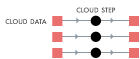
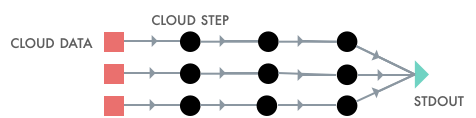

#### [Examples](#examples)  | [Tutorials](#tutorials) | [Blogs](#blogs) | [Installation](#installation)

# Super: A CLI for the Serverless Supercomputer

**Super** runs a normal UNIX command line against Cloud data, using
Cloud compute resources. Super takes care of provisioning the right
amount of compute, memory, and disk capacity, scheduling your jobs,
granting the needed data access authority to your work, and streaming
out logs &mdash; all in one command: `super run`.


Super also automatically injects logic to track the progress of
**any** job against your Cloud data. You get helpful progress bars for
free.


Super links Cloud compute from [IBM Cloud Code
Engine](https://www.ibm.com/cloud/code-engine) with Cloud data in any
S3 provider, such as [IBM Cloud Object
Storage](https://www.ibm.com/cloud/object-storage).

### Example 1


Using the -p option, Super can run a fixed number of UNIX command
lines, in the Cloud.

```sh
super run -p3 -- printenv JOB_INDEX
[Job 1] 1
[Job 2] 2
[Job 3] 3
```

### Example 2



Super can auto-scale across a glob pattern of Cloud data. In this
case, the glob will expand to 3 files, hence Super will spawn <= 3
Cloud jobs to host the copy. No need to set up VMs nor to transfer the
data to and from your laptop.

You may copy your files to any `/s3/...` path. Here, we use the
convenience `/s3/ibm/tmp` path that Super provides.

```sh
super run -- cp \
  '/s3/aws/commoncrawl/crawl-data/CC-MAIN-2021-21/segments/1620243992721.31/wet/*-0000{1,2,3}.warc.wet.gz' \
  /s3/ibm/tmp
```

### Example 3



Super pipelines are normal UNIX pipelines. Use high-performance UNIX
pipes `|`, but against Cloud data and compute.  This again will spawn
3 jobs and produce the word count output on your console. Here we are
using grep and wc in the Cloud to compute a partial sum of matches.

```sh
super run -- 'cat /s3/ibm/tmp/*.wet.gz | gunzip -c - | grep "WARC-Type: conversion" | wc -l'
[Job 1] 40711
[Job 2] 40880
[Job 3] 40681
```

### Example 4


You can also pipe the output of a Cloud job to a local pipeline. This
pipeline uses a local `awk` to sum the partial sums generated by the 3
jobs.

```sh
super run -- \
  'cat /s3/ibm/tmp/*.gz | gunzip -c - | grep "WARC-Type: conversion" | wc -l' \
  | awk '{N+=$1} END {print N}'
122272
```

### Example 5

Super pipelines also handle redirects to Cloud storage. This example
will redirect the output to N output files in the given dst bucket.
Have some fun! Fill in our own ideas for the ... part of this
pipeline.

```sh
super mkdir /s3/ibm/tmp/dst
super run -- 'gunzip -c /s3/ibm/tmp/*.gz | ... > /s3/ibm/tmp/dst'
```

### Example 6

You may also inject custom scripts into the running jobs. You may use
any Cloud bucket to store your binaries. Here, we use the convenience
path `/s3/ibm/bin` that Super provides.

```sh
super mkdir /s3/ibm/tmp/dst
super cp myAnalysis.sh /s3/ibm/bin
super run -- \
  'gunzip -c /s3/ibm/tmp/*.gz | /s3/ibm/bin/myAnalysis.sh > /s3/ibm/tmp/dst'
```

## Tutorials

- [Getting to Know Super](docs/tutorial/basics/#readme)

## Blogs

- [Exploring Big Data with a CLI](https://medium.com/the-graphical-terminal/exploring-big-data-with-a-cli-59af31d38756)
- [Bash the Cloud](docs/blogs/1-Super-Overview/README.md#readme)

## Installation


The latest build of Super is available
[here](https://github.com/IBM/super/releases). After you have downloaded
your release:

```sh
tar jxf Super-darwin-x64.tar.bz2
export PATH=$PWD/Super-darwin-x64/Super.app/Contents/Resources:$PATH
super
```

You should now see usage information for Super, including the main
sub-commands:
- [`super up`](docs/commands/super-up.md)
- [`super run`](docs/commands/super-run.md)
- [`super dashboard`](docs/tutorial/basics/super-dashboard.md)
- [`super browse`](docs/tutorial/basics/super-browse.md)

We suggest first trying [`super up`](docs/commands/super-up.md), which
will validate your prerequisites. If you are good to go, then you can
try `super run -p5 -- echo hello`, which will execute that command as
five Cloud jobs. If this all looks good, then proceed to the
[**Getting to Know Super**](docs/tutorial/basics#readme) tutorial.
