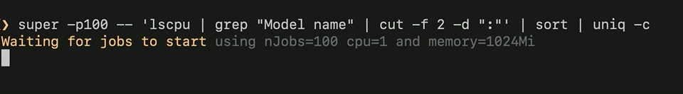

#### [Installation](#installation) | [Tutorials](#tutorials) | [Blogs](#blogs)

# Super: A CLI for the Serverless Supercomputer

**Super** offers a zero-config and zero-code entry to your Cloud. It
does so by running **normal UNIX command lines** against Cloud data,
using Cloud compute. Super takes care of hooking these complex and
disparate resources together under one command: [`super
run`](docs/commands/super-run.md).

<a name="super-copy">

## A Super Way to Copy

[](docs/examples/example2.md)

For example, Super can **copy a set of files** from one place in the
Cloud to another.

```sh
super run -- cp /s3/ibm/default/src/foo*.txt /s3/aws/dst
```

Behind the scenes, Super spawns Cloud Compute to mediate the
Cloud-to-Cloud data transfer. It uses
["glob"](https://en.wikipedia.org/wiki/Glob_(programming)) patterns to
determine how many concurrent jobs to run. For example, if `foo*.txt`
matches 5 files, Super spawns a set of concurrent jobs, grants each
job the least privilege to access its assigned files, and more!

Because Super intelligently parses your command line, it can
automatically inject progress trackers. Super **tracks the progress of
any job** against your Cloud data.


Super leverges **any Kubernetes cluster** for Compute and **any S3
provider** for Data. If you wish to target a very large cluster, Super
integrates with [IBM Cloud Code
Engine](https://www.ibm.com/cloud/code-engine). It also can hook your
Compute jobs up with [IBM Cloud Object
Storage](https://www.ibm.com/cloud/object-storage). The [`super
up`](docs/commands/super-up.md) command gives you an easy way to
leverage both.

**There is no need to code to the Cloud API of the week to make any of
this happen.**

:rocket: **[Take me to the Installation Instructions](#installation)**

## What Other Kinds of Pipelines Can Super Run?

Click on an image for more detail on that use case.

[](docs/examples/example1.md)
[](docs/examples/example2.md)
[](docs/examples/example3.md)
[](docs/examples/example4.md)
[](docs/examples/example5.md)
[](docs/examples/example6.md)

## Installation

[macOS Intel](https://github.com/IBM/super/releases/latest/download/Super-darwin-x64.tar.bz2) **|** [macOS Apple Silicon](https://github.com/IBM/super/releases/latest/download/Super-darwin-arm64.tar.bz2)

|macOS|Others|
|-----|------|
|```sh
brew tap IBM/super https://github.com/IBM/super
brew install super
super
```|-----|

You should now see usage information for Super, including the main
sub-command: [`super run`](docs/commands/super-run.md).

## Getting Started: Using `super run` to submit pipelines to Cloud Compute

Out of the box, `super run` will use **your current Kubernetes
context** as the target for Compute, and will have read-only access to
public S3 buckets. 

If this works for you, then try `super run -p5 -- echo
hello`. [Above](#super-copy), we used a glob pattern to specify the
Cloud jobs we needed; here, since we are not pulling in Cloud data, we
instead use `-p5` to specify that we want to execute the given command
line as five Cloud jobs.



### Using `super browse` to explore input Cloud Data

To browse for interesting [CommonCrawl](https://commoncrawl.org/)
input data, you may use [`super browse
cc`](docs/tutorial/basics/super-browse.md). Super pipelines can access
S3 data via a pseudo `/s3` filepath; e.g. `/s3/aws/commoncrawl` is the
prefix for CommonCrawl data.

### Using `super up` to connect to your Cloud Provider


The [`super up`](docs/commands/super-up.md) command will attempt to
connect `super run` to your AWS credentials and to IBM Cloud. The
latter allows `super run` to scale to a large Kubernetes cluster with
hundreds of nodes, via [IBM Cloud Code
Engine](https://www.ibm.com/cloud/code-engine); `super up` can also
connect you to your [IBM Cloud Object
Storage](https://www.ibm.com/cloud/object-storage) instances.

## Tutorials

- [Getting to Know Super](docs/tutorial/basics/#readme)

## Blogs

- [Exploring Big Data with a CLI](https://medium.com/the-graphical-terminal/exploring-big-data-with-a-cli-59af31d38756)
- [Bash the Cloud](docs/blogs/1-Super-Overview#readme)
- [Analyzing CommonCrawl with Bash](docs/blogs/2-Super-CommonCrawl#readme)
