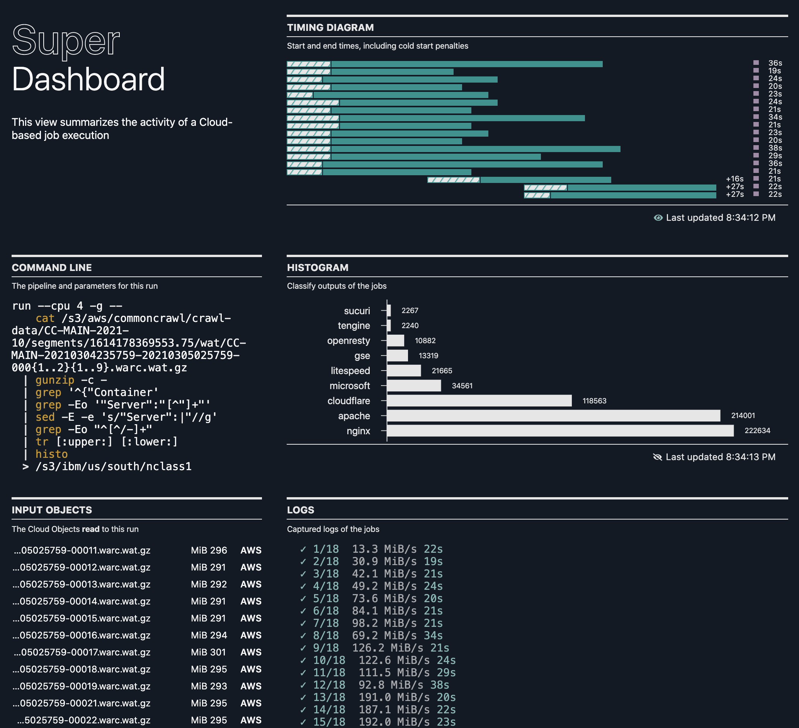

# Bash the Cloud with Super

**Super** allows you to run a UNIX command line *in parallel*, using
auto-scaling Cloud compute resources, against a set of Cloud data.
Super takes care of provisioning the right amount of compute, memory,
and disk capacity, scheduling your jobs, granting the needed data
access authority to your work, and streaming out logs --- all in one
command: `super run`.


Super knows how to track the progress of any job against your Cloud
data. You will know, without any extra work, how much of your Cloud
input files has been processed!

Super uses containers running in IBM Cloud [Code
Engine](https://www.ibm.com/cloud/code-engine) as the compute layer,
and gives your jobs access to data via IBM [Cloud Object
Storage](https://www.ibm.com/cloud/object-storage).

## Installation


The latest build of Super is available
[here](https://github.ibm.com/kui-shell/kiwi/releases). After you have
downloaded your release:

```sh
tar jxf Super-darwin-x64.tar.bz2
export PATH=$PWD/Super-darwin-x64/Super.app/Contents/Resources:$PATH
super
```

You should now see usage information for Super, including the main
sub-commands:
- [`super up`](docs/commands/super-up.md)
- [`super run`](docs/commands/super-run.md)
- [`super dashboard`](docs/tutorial/super-dashboard.md)
- [`super browse`](docs/tutorial/super-browse.md)



We suggest first trying [`super up`](docs/commands/super-up.md), which
will validate your prerequisites. If you are good to go, then you can
try `super run -p5 -- echo hello`, which will execute that command as
five Cloud jobs. If this all looks good, then proceed to the
**Tutorial** in Further Reading.

## Further Reading

To read more about a UNIX Way for the Cloud, read on:

1. [Tutorial: Getting to Know Super](docs/tutorial/README.md#readme)
2. [Blog: Bash the Cloud](docs/blogs/1-Super-Overview/README.md#readme)

