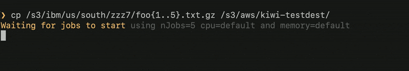

# Bash the Cloud

Cloud is the anti-UNIX. It is a world where nothing really is a file,
and computation must be allocated, planned, and utilized by careful
employment of a hundred miserable CLIs and APIs.

That is not to say we are anti-Cloud. We love that resources can be
pooled, and that the costs of idling and management can be amortized
across many and disparate consumers. The Cloud truly can be a modern
day operating system, interpreting our desires and managing hardware
with precision and transparency.


What would ["the UNIX
way"](https://en.wikipedia.org/wiki/Unix_philosophy) be for a Cloud
computer? This animated GIF captures our desire: UNIX pipelines, but
against Cloud data and compute resources. We will expand on this
example below.

## UNIX Pipelines in the Cloud

We believe that a rich subset of Cloud tasks are amenable to a
lightweight and bash-like approach to analyzing data.

When one crafts a UNIX pipeline for local operations, the focus is at
a pretty high level: on the data. We are concerned with where it
originates (so we can `cat` the right set of filepaths), where it must
eventually settle (so we can `>` redirect to the proper destination
filepath), and how the schema of the data can be manipulated with
existing off-the-shelf tools. APIs are largely a secondary concern.

We desire a Cloud CLI where typing `cat /s3/data.txt.gz | gunzip -c - | classify.py | sort | uniq -c > /s3/out.txt`
frees us from the burdens of allocating and scheduling resources, 
keeping data and computation close, acquiring and propagating data
authorization to the compute engines, flow control and chunking and
caching, of when to scale up versus scale out --- that all of this,
and the APIs needed to direct each of these disparate concerns, is
hidden behind that simple utterance.


With some careful thought put into the tooling story, we have found
that this is indeed possible. We can *compile* high-level utterances
into executions that have both scale-up and scale-out parallelism,
without coding to a parallel API such as
[Spark](https://spark.apache.org/) or [Ray](https://ray.io/).

Surprisingly, we have found that the resulting executions also have
high computational density. By always streaming data and leveraging
fast C-coded utilities, the MiB/sec/core of such pipelines can often
exceed most other approaches. This knock-on effect has been [observed
by
others](https://adamdrake.com/command-line-tools-can-be-235x-faster-than-your-hadoop-cluster.html).

### Example: Classify the processors in the Cloud

The animated GIF shown at the start of this blog (the one with the
progress bar) illustrates a pipeline that classifies the CPU types of
a Cloud provider. This example fires off a command line for execution
in the Cloud, and presents the result on the console; it includes both
fork/join parallelism and (a bit of) pipeline parallelism:

```sh
❯ super -p100 -- 'lscpu | grep "Model name" | cut -f 2 -d ":"' | sort | uniq -c
91 Intel Core Processor (Broadwell, IBRS)
 9 Intel Xeon Processor (Cascadelake)
```


Our approach interprets this to mean: "fork off 100 pipelines and
join the results into a histogram via `sort | uniq`.

Users of this approach will need some way to express which portions of
the pipeline are done in the Cloud (i.e. in the fork), and which are
done on our laptops (after the join).  In this example, the 'quoted
part' is forked and executed in the Cloud, and the streaming output of
those jobs is fed into a local pipeline (`| sort | uniq -c`). The
final output is presented on the user's console, as per usual with
UNIX pipelines. [GNU Parallel](https://www.gnu.org/software/parallel/)
adopts a similar syntactic ploy.

### Example: Globbing the Cloud

When operating on Cloud data, we can make the syntax more
transparent. By leveraging the
["globbing"](https://en.wikipedia.org/wiki/Glob_(programming))
capability of UNIX shells, the set of matched files can represent an
implicit fork. For example, `cp /s3/src/*.txt.gz /s3/dst` has a glob
over the source files. This command line can be interpreted to mean
"fork a copy job for every matched source file". Even simple copy
tasks may benefit greatly from taking place entirely in the
Cloud. Doing so avoids downloading and reuploading the
data. Furthermore, Cloud providers often do not charge for in-Cloud
data access.



This GIF shows the transparent use Cloud compute resources to mediate
copies between Cloud providers (from IBM to AWS, in this case).  In
the next blog, we will analyze [CommonCrawl](https://commoncrawl.org/)
data using this globbing approach. We will also go into more detail on
what this `/s3` filepath means.

### Big Idea 1: Bash helps us to be Optimal, without Optimizing

Optimization and parallelization are hard, unforgiving jobs.  A bash
pipeline, in contrast, benefits from data prefetching and pipeline
parallelism, without any extra coding. We have found that common
pipelines against CommonCrawl data have a net concurrency of 2-3;
i.e. these pipelines, when executed as Kubernetes jobs, utilize an
average 2-3 processor cores, all without any explicit parallelism. For
more details, stay tuned for our next blog.

### Big Idea 2: Bash is Anti-Viral

If everything is a stream, then any utility, whether C, Python, Perl,
or Bash --- as long as it accepts and then produces a stream --- can
participate in a streaming pipeline. This allows us to leverage UNIX
standards such as `grep` and `sed` and `awk`, which are versatile and
perform amazingly well. They are also backed by a large corpus of
examples and guidance on StackOverflow and the like.

### Big Idea 3: Bash has a simple Introspection Model

It is easy to splice in debugging functionality at any point in a
pipeline. For example, one can insert `tee` or tools like the
[pipeline viewer](http://www.ivarch.com/programs/pv.shtml) `pv` where
needed: `gunzip -c input.txt.gz | pv
| ...` tells you the rate of decompression with only a minor syntactic change. This spliced pipeline has the same output, and has nearly indistinguishable performance.

Better yet, this extra functionality is also anti-viral; a single `pv`
utility works with any pipeline. There is no need to find the
Go/NodeJS/Python variant of this functionality, code to its API, find
a way to disable it when in production, etc.

## Further Reading

  1. ["Analyzing CommonCrawl Data with `grep` and
     `awk`"](../2-Super-Examples/#readme), which will go into greater
     detail with three examples that classify large data sets from
     CommonCrawl.
  2. "Browsing CommonCrawl with Ease", which will describe a tool that
     allows you to quickly browse all of CommonCrawl, using a shell in
     your browser.
  3. "How to Super-power Bash Using IBM CodeEngine", which will
     describe the architecture and implementation details of this
     approach.
