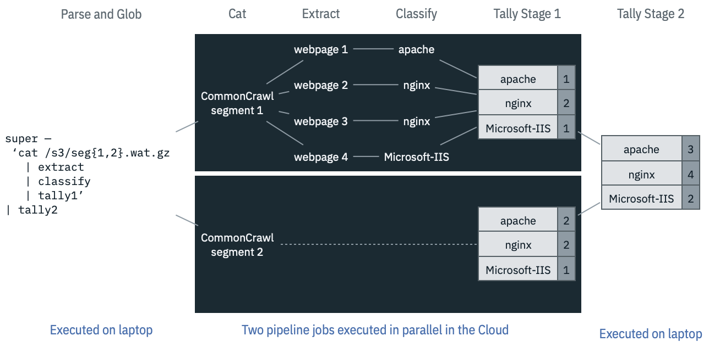
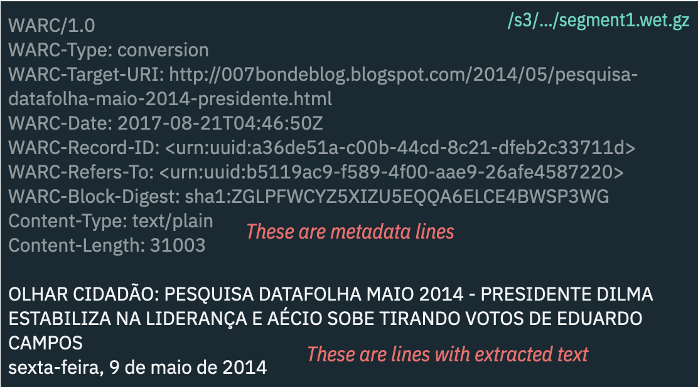
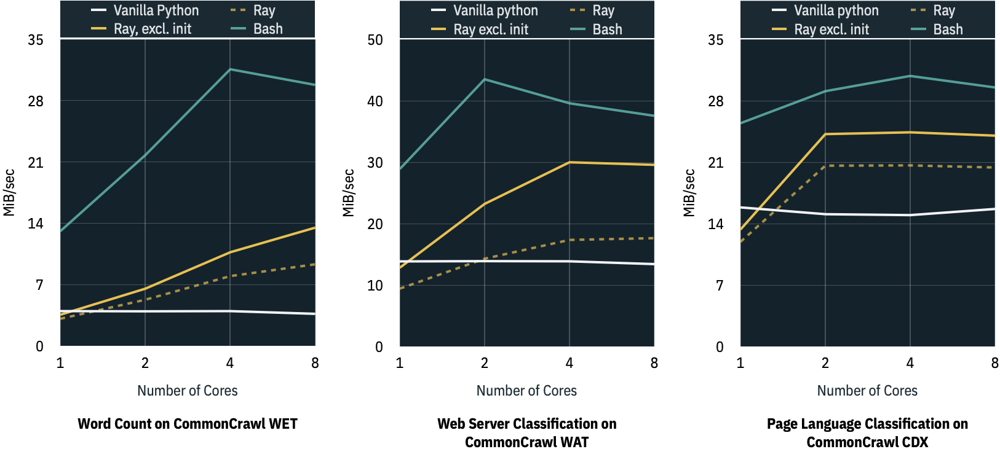

### Table Of Contents

- [Running UNIX Commands in the Cloud](../../tutorial/README.md#readme)
- [Interacting with Cloud Object Storage](../../tutorial/super-cos.md#readme)
- [Visually Browsing Cloud Object Storage](../../tutorial/super-browse.md#readme)
- [Parallelizing your UNIX Pipeline](../../tutorial/super-parallelism.md#readme)
- [Injecting Custom Binaries](../../tutorial/super-cloudbin.md#readme)
- [Examples of parallel analytics against CommonCrawl data](./2-Super-CommonCrawl/README.md#readme) **[You are here]**
- [Automating Periodic Tasks](../../tutorial/super-every.md#readme)

# Analyzing CommonCrawl Data with `grep` and `awk`

The Cloud has many features of a large, distributed, and very hard to
use computer.  What would a simpler ["UNIX
way"](https://en.wikipedia.org/wiki/Unix_philosophy) be for such a
Cloud computer? We have been experimenting with adopting UNIX
pipelines, an approach that has proven itself, over decades, as a
viable way to handle large amounts of data. This approach was designed
precisely for the situation where input size greatly exceeds available
local memory.

With UNIX pipelines, I can stream through data with `cat`, direct
output flow with `>`, and pipe stages through standard utilities,
written in any language. In our [previous
blog](../1-Super-Overview/#readme), we introduced "Bash the Cloud", a
scheme for compiling a bash command line into a Cloud execution.

In this blog, we will show how to analyze a very large Cloud-based
data set using this approach. We will use
[CommonCrawl](https://commoncrawl.org/) as our corpus, and give
example pipelines that **classify** web pages in three ways:

1. [the canonical word count](#example-1-word-count)
2. [classifying pages by hosting web server](#example-2-web-server-classification)
3. [classifying pages by language](#example-3-language-classification)

For each, we will compare the performance of this bash approach to
standalone Python code and to [Ray](https://ray.io/).

## The CommonCrawl Data Sets

[CommonCrawl](https://commoncrawl.org/) is an archive of a decade's
worth of web sites from around the world. The archive is stored in
Amazon S3, and is available for public consumption. CommonCrawl scans
the web bi-yearly. Each scan has been preprocessed into four formats,
with the data for each format sharded into several hundred chunks. Our
three examples operate against three of these four formats: WET files,
WAT files, and CDX files.

### Mounting the Cloud on `/s3`

When a filepath begins with `/s3`, we consider it to be hosted in an
[S3](https://en.wikipedia.org/wiki/Amazon_S3) bucket;
e.g. `/s3/aws/commoncrawl` contains the CommonCrawl data sets. In UNIX
parlance, we must ensure that the Cloud storage relevant to your needs
has been [*mounted*](https://en.wikipedia.org/wiki/Mount_(computing)),
with proper authorization, on `/s3/<provider>`. This means one should
be able to issue `ls`, `cd`, `cat`, `head`, and other UNIX
file-oriented commands against those s3 filepaths.

### How do we know what input files to use?

To code an analysis pipeline requires candidate input files and some
knowledge of their schema. Everything we do to the data depends on
this: what we grep for to filter out irrelevant records, how we
project out the needed fields, and so on.

In our next blog, we will demonstrate a Cloud data discovery tool that
we find particularly powerful. For now, we will assume this step has
been done, and assert a set of useful `/s3` CommonCrawl filepaths.

## Using UNIX pipelines for Two-Stage Parallel Classification

Our examples in this blog perform web page
[*classification*](https://en.wikipedia.org/wiki/Data_classification_(business_intelligence)). Each
analysis assigns a web page to one or more buckets, which can then be
tallied up as the analysis runs. For example, the web server
classification example maps each page to one bucket (identified by the
name of the hosting web server).



In order to scale the analysis across many nodes, each node can
analyze one segment of the crawl; CommonCrawl breaks up the crawl
results into segment files. The classification thus proceeds in an
[embarrassingly
parallel](https://en.wikipedia.org/wiki/Embarrassingly_parallel)
fashion across the segments.

As nodes complete their individual tallies, this first stage of output
can be streamed into a second stage tally that combines the individual
tallies by vector addition.

To implement the tallies, one could write a one-liner
[`awk`](https://en.wikipedia.org/wiki/AWK) script, write custom Python
code, use UNIX [`sort`](https://en.wikipedia.org/wiki/Sort_(Unix)) and
[`uniq`](https://en.wikipedia.org/wiki/Uniq), or whatever other
methods suit your fancy. The same goes for the other stages of your
analysis pipeline. Below, we will make some choices that suit *our*
fancies, but there is nothing sacrosact in these choices.

## Example 1: Word Count

To classify the web by words used, we can analyze the CommonCrawl
**WET** format files. This information houses the extracted text from
each web page, and is stored in a collection of gzip-compressed files
(these are the CommonCrawl "segment" files). The file format includes
a mix of metadata lines and lines with the extracted text.

If we filter out the metadata lines, then split the remaining
text-only lines so that each line contains a single word, we now have
set of classes: each line represents a classification (by words used)
of the web.

We can use UNIX utilities to do all of this. To read and uncompress
the WET files, we can use `cat | gunzip`. To filter out irrelevant
lines, `grep -Ev '^WARC|Content-'`. To have each line contain only one
word, `tr ' ' '\012'` will replace whitespace with the octal
representation for an ASCII newline. We can then pipe this into `sort
| uniq -c` which serve, if not optimally at least competently, to tally up the word classes:



```sh
cat /s3/.../segment1.wet.gz | \
    gunzip -c - | \
    grep -Ev '^WARC|Content-' | \
    tr ' ' '\012' | \
    sort | uniq -c'
```

The rest boils down to heuristics to eliminate uninteresting
words. For example, most short words can be pretty safely excluded.
This can be done via e.g. `grep .....`, which will exclude any words
shorter than 5 characters. We may also wish to have a case-insensitive
classification; this can be done via `tr [:upper:] [:lower:]`.

And so on! We can add as many stages to this pipeline, to iteratively
refine our classification, without much concern for performance. UNIX
pipelines and the standard suite of UNIX utilities are fairly
oblivious to pipeline length.

With this, we can now follow the recipe from above, to perform a
two-stage classification against any number of files.

## Example 2: Web server classification

To classify the web by the web server that hosted the page, we can
analyze the CommonCrawl **WAT** format files. WAT files, like the WET
files, have a mix of two types of lines. The lines we care about are
those that are a JSON-formatted string. This JSON structure stores
extracted metadata for a given web page, such as the HTTP response
headers from the crawl. We can pull out the `Server` response header
field from these JSON lines.

Just as with the WET example, a straightforward pipeline of `grep` and
`tr` can do most of the work we need. To filter down to the JSON
lines, `grep '^{\"Container'`.  Next, if performance is not a major
concern, one could then pipe these lines to `jq` to project out the
field of interest; if you're willing to invest a bit more effort, then
a combination of `grep` and `sed` can get the same effect, and twice
as fast: `grep -Eo '"Server":"[^"]+"' | sed -E -e 's/"Server":|"//g'`;
the `grep` extracts the server field, both key and field, and the
`sed` removes the key part. 

We find this approach attractive: there exist off-the-shelf tools that
make the job quick and easy. Then, later, when you're ready to invest
the effort, substantial gains are possible.

You may also want to canonicalize the server name in various ways;
e.g. by case-normalizing using `tr` as above, and collapsing the
version variants of each server (e.g. you may want "apache 2.x" and
"apache 2.y" to belong to the same class). As always, straightforward
use of standard UNIX utilities can get you there; but you can write
your logic in any language you please, as long as it accepts a stream
as input and produces a stream as output, it can be plugged into the
two-stage classification scheme.

## Example 3: Language classification

To classify the web by the languages to which the pages have been
translated, we can analyze the CommonCrawl CDX files. Each line in
these files represents a web page, and contains a mix of metadata and
a JSON fragment; the latter has a field that specifies languages to
which this web page has been translated.

And the rest follows the same approach as the prior two examples. For
example, you may use `awk -F '"languages": "' '{ print $2 }'` to
approximately extract the languages field of the JSON structure,
without even parsing it fully. The languages field is a
comma-separated list (not a JSON array); you may use `tr , '\012'` to
split the languages so that there is one language per line --- just as
we did above for words.

## Performance Comparisons

Surprisingly to us, this approach not only gives you the flexibility
of mix-and-matching utilities written in whichever language you
prefer, it also performs quite well.

This figure summarizes the megabytes per second for the three
examples, comparing our UNIX pipeline approach (the series labeled
"Bash" in a cyan-blue color) to Ray (in yellow) and plain Python (in
white). These experiments are for analyzing a single file, so that we
could tease out the computational density of each approach.



For each, we ran the code on 1, 2, 4, and 8 core VMs. Observe that our
Bash approach shows good scaling from 1 to 2 cores, and, for the word
count example, this scaling continues up to 3-4 cores. In other words,
our approach extracts parallelism, even when analyzing one file, and
without any explicit parallelism! All of the scale-up performance
gains come from the inherent pipeline parallelism: UNIX knows how to
run the `cat`, `gunzip` and `grep` in parallel, and also how to
properly balance the flow control so that the pipeline proceeds at the
pace of the slowest pipeline stage.

## Further Reading

  1. ["Bash the Cloud"](../1-Super-Overview/#readme), which introduces
     the technique of using UNIX pipelines to analyze large datasets
     in the Cloud.
  2. "Browsing CommonCrawl with Ease", which will describe a tool that
     allows you to quickly browse all of CommonCrawl, using a shell in
     your browser.
  3. "How to Super-power Bash Using IBM CodeEngine", which will
     describe the architecture and implementation details of this
     approach.
