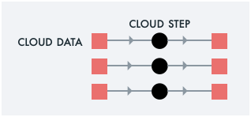

# What Kinds of Pipelines Can Super Run?

Click on an image for more detail on that use case.

|Example|Visually|
|-------|--------|
|Fixed fan-out Output to stdout||
|Fan-out across S3 input files Output to console||
|Fan-out across S3 input files Output to S3||
|Fan-out across S3 input files Post-process via streaming join||
|Super supports dropping in custom binaries||
|Periodic pipeline execution||
