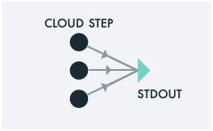

# Super Power 2: Auto-scaling across a set of Cloud Data


Super can auto-scale to **process a set of input files in
parallel**. All you need to do is specify a normal UNIX glob pattern
over Cloud file paths. Super takes care of determining how many jobs
it should fire off, and grants your jobs the least privilege they will
need to access the specified data.

In Super, a Cloud file path begins **`/s3`**. For example, to process
a set of [CommonCrawl](https://commoncrawl.org/) data in parallel, you
may point Super to a file path such as

```sh
/s3/aws/commoncrawl/crawl-data/CC-MAIN-2021-21/segments/1620243992721.31/wet/*-0000{1,2,3}.warc.wet.gz
```

In this case, the glob `*-0000{1,2,3}.warc.wet.gz` will expand to 3
files. A `super run` pointed to this filepath will spawn no more than
3 Cloud jobs to host the computation. No need to set up VMs nor to
transfer the data to and from your laptop.

> **Hints**: Try `super ls` to explore `/s3` file paths in your
> terminal. Try `super browse`, which lets you explore via point and
> click.

## Example

It is common to need to move data from place to place within the
Cloud. You may use `super run` and `cp` to do so:

```sh
super run -- cp \
  '/s3/aws/commoncrawl/crawl-data/CC-MAIN-2021-21/segments/1620243992721.31/wet/*-0000{1,2,3}.warc.wet.gz' \
  /s3/ibm/tmp
```


> **Hint**: Make sure either to `'quote'` or `\`-escape any glob
> characters, such as `*` or `{`, to prevent premature expansion of
> the patterns.

### A Cloud /tmp

You may copy your files to any `/s3/...` path. Here, we use the
convenience `/s3/ibm/tmp` path that Super provides for IBM Cloud
Object Storage. This serves as your `/tmp` bucket, in the Cloud.

## Directing Output back to the Cloud via `>`

This `cp` example is a special case of a more general pattern of
redirecting the output of a Cloud computation back to Cloud
storage. In UNIX, you would use `>` to "redirect" the output of a
computation to a given file path. In Super, the same holds for Cloud
file paths!

This example will redirect the output to N output files in the given
dst bucket.  Have some fun! Fill in our own ideas for the ... part of
this pipeline.

```sh
super mkdir /s3/ibm/tmp/dst
super run -- 'gunzip -c /s3/ibm/tmp/*.gz | ... > /s3/ibm/tmp/dst/out-$j.txt'
```

## Other Super Powers

[](example1.md)
[](example3.md)
[](example4.md)
[](example5.md)
[](example6.md)
