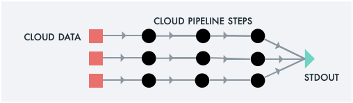
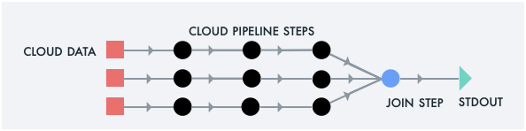

# Super Example 5: Injecting Cloud Binaries


You may also inject custom scripts into the running jobs. You may use
any Cloud bucket to store your binaries. Here, we use the convenience
path `/s3/ibm/bin` that Super provides.

<br>
<br>

```sh
super mkdir /s3/ibm/tmp/dst
super cp myAnalysis.sh /s3/ibm/bin
super run -- \
  'gunzip -c /s3/ibm/tmp/*.gz | /s3/ibm/bin/myAnalysis.sh > /s3/ibm/tmp/dst/out-$j.txt'
```

## Other Examples

[](example1.md)
[](example2.md)
[](example3.md)
[](example4.md)
<!--[](example5.md)-->
