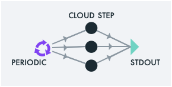

# Super Power 6: Periodic Pipelines



To automate the execution of a pipeline, so that it executes
periodically in an unattended fashion, use `super every`. This command
accepts all of the [options for `super
run`](example1.md#super-run-options), plus two additional required
parameters: one for specifying the time period between executions of
the given pipeline, and a second for specifying the *profile* against
which to run the automated task.

When automating a pipeline, you will likely be running the pipeline
against a different set of Cloud resources, compared to what you use
for development. In Super, the set of choices that pertain to these
Cloud resources is called a *profile*. This is the second additional
parameter to `super every`, the `--as` option.

## Specifying the Time Period for Your Periodic Automation

The time period between executions of a given pipeline is indicated by
the first positional paramter. When specifying your period, you may
use the conventional shorthands for time units. For example `super
every 5m --- a | b | c` will execute that pipeline every five minutes;
`4h` denotes a four-hour period, and `1d` denotes a daily periodicity,
and so on.

> For a full list of shorthands, consult the [parse-duration
> API](https://github.com/jkroso/parse-duration#available-unit-types-are).

## Profiles: Specifying the Cloud Resources to Host the Automation

1. Create a profile:

```sh
super create profile <profileName> \
  --apikey=<...> \
  --resource-group=<...> \
  --code-engine-project=<...> \
  --cos-instance=<...> \
  [--region=<...>]
```

You may list your profiles via `super get profile`, and see the
 details of a given profile via `super get profile <profileName> -o
 yaml`. 
 
2. Now you may bind these choices to future automations via `super
   every --as <profileName>`

## Example

To generate a histogram of the CPU models running in your Cloud, every hour:

```sh
super every 60m -p3 -- 'lscpu | grep "Model name" | cut -f2 -d ":"' | sort | uniq -c
```

To list your current periodic tasks:

```sh
super every list
```

## Other Super Powers

[](example1.md)
[](example2.md)
[](example3.md)
[](example4.md)
[](example5.md)
