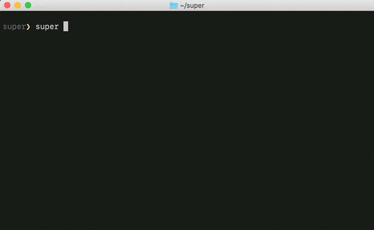

### Table Of Contents

- [Running UNIX Commands in the Cloud](./README.md#readme)
- [Interacting with Cloud Object Storage](./super-cos.md#readme)
- [Visually Browsing Cloud Object Storage](./super-browse.md#readme) **[You are here]**
- [Parallelizing your UNIX Pipeline](./super-parallelism.md#readme)
- [Injecting Custom Binaries](./super-cloudbin.md#readme)
- [Examples of parallel analytics against CommonCrawl data](../blogs/2-Super-Examples/README.md#readme)
- [Automating Periodic Tasks](./super-every.md)
- [The Super Dashboard](./super-dashboard.md#readme)

# Visually Browsing Cloud Object Storage via `super browse`

If you wish to analyze data that is stored in the Cloud, it can be
helpful first to browse your Cloud objects. This exercise can yield
the full filepaths that you can plug into your `super run` pipelines,
e.g. `/s3/ibm/us/south/myBucket/myFolder/myData*.gz`.



Super offers two commands to help you visually browse Cloud data.  The
first is:

```sh
super browse cc
```

When you issue this command from your terminal, a window will pop
up. This popup window directs you to the
[CommonCrawl](https://commoncrawl.org/) public data set, hosted on
AWS. This data set has many years worth of web crawls. It can be a
helpful way to get started with rapid development of Cloud-based
parallel analytics against large data sets.

From the popup window, you can type normal UNIX `ls` and `cd` commands
to navigate the directory structure of the CommonCrawl
data. Alternatively, you may use your mouse to click-navigate. The GIF
to the right shows this style of navigation.

You may also wish to learn the schema of your input data. From the
animated gif to the right, you can see that we ultimately find a file
of interest. These are large compressed files. With `super browse`, we
can easily study the schema of our candidate input file. Also, we can
capture the full filepath, close the window, and return to our plain
terminal with that filepath in our copy buffer.

The second browsing command is:

```sh
super browse s3
```

This command behaves identically to the first, except that the
starting point for exploration are your own Cloud objects.

