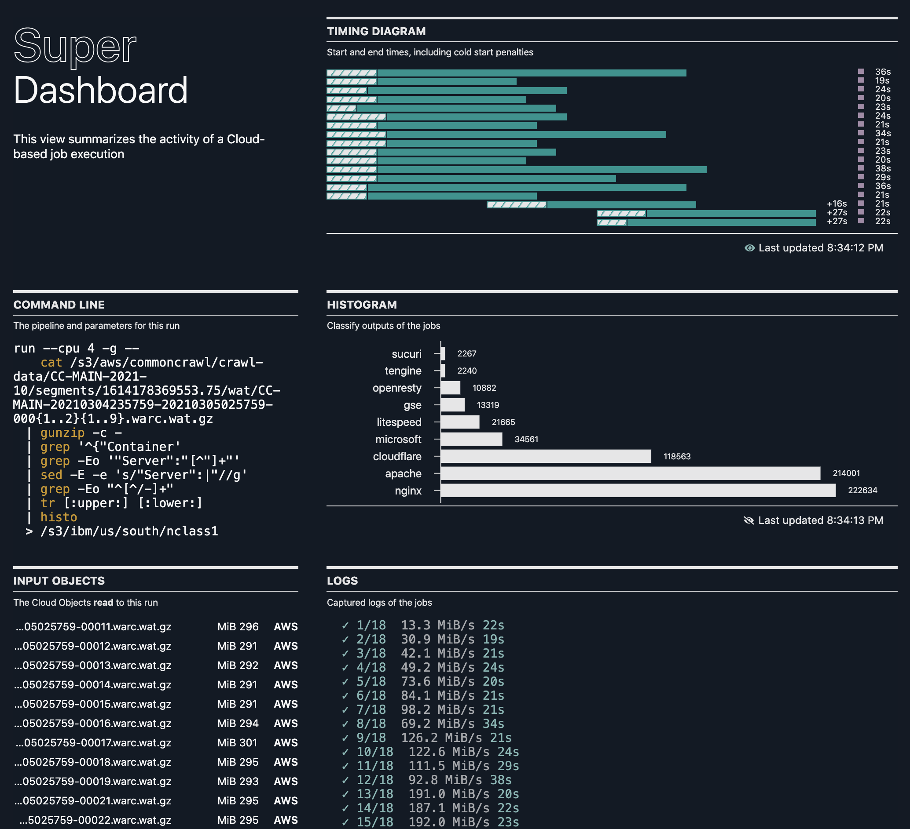

### Table Of Contents

- [Running UNIX Commands in the Cloud](./README.md#readme)
- [Interacting with Cloud Object Storage](./super-cos.md#readme)
- [Visually Browsing Cloud Object Storage](./super-browse.md#readme)
- [Parallelizing your UNIX Pipeline](./super-parallelism.md#readme)
- [Injecting Custom Binaries](./super-cloudbin.md#readme)
- [Examples of parallel analytics against CommonCrawl data](../blogs/2-Super-Examples/README.md#readme)
- [Automating Periodic Tasks](./super-every.md)
- [The Super Dashboard](./super-dashboard.md#readme) **[You are here]**

# The Super Dashboard



```sh
super db
```

